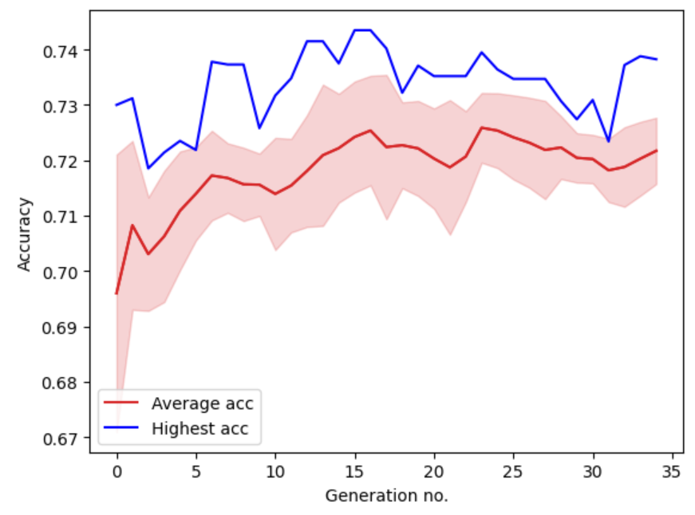

# Neural architecture search 🔍
This is the final project for the course **CS410 - Neural network and genetic algorithms** at University of Information Technology (UIT). It implements the approach from the paper [Genetic CNN](https://arxiv.org/abs/1703.01513) using **classical** and **POPOP + tournament selection** genetic algorithms.

The construction of neural networks from binary representation is from https://github.com/song9446/Genetic-CNN/blob/master/genetic_cnn.py

The results are not as good as those presented in the paper due to limited computational power.

